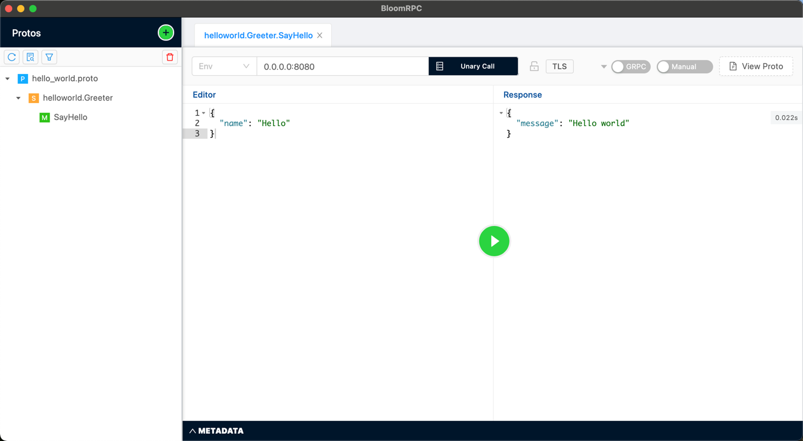

# grpc-gateway-demo

# How to invoke local gRPC Server

## gRPC

~~~shell
brew install --cask bloomrpc
~~~

## http

~~~shell
$ curl -X POST -k http://localhost:8090/v1/example/echo -d '{"name": " hello"}'

{"message":" hello world"}%
~~~

# Reference

* [grpc-gateway](https://www.liwenzhou.com/posts/Go/grpc-gateway/)